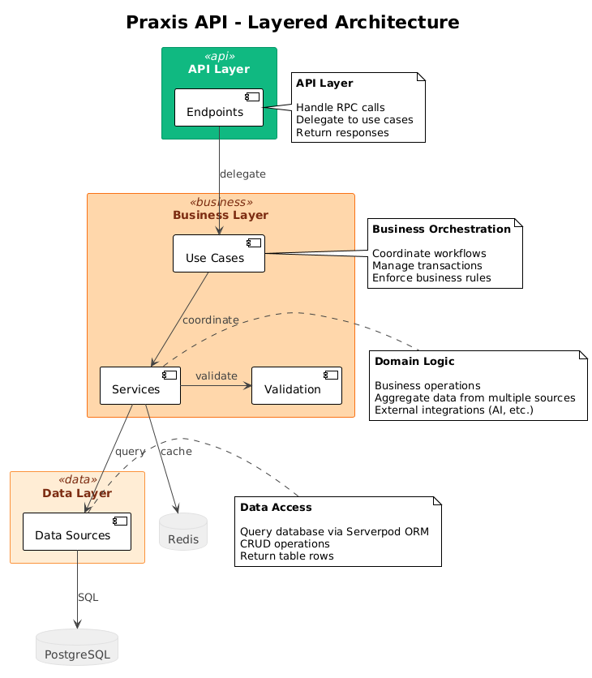

# Praxis API

[](https://dart.dev)
[](https://serverpod.dev)

Серверная часть образовательной платформы **Praxis** – интерактивной системы обучения программированию с AI-ассистентом и отслеживанием прогресса.

**[Документация](#документация)** • **[Быстрый старт](#быстрый-старт-локально)** • **[API](#обзор-api-эндпоинты-serverpod)**

---

**Языки:** [English](../../README.md) • [Русский](#)

## Обзор

Praxis Server построен на [Serverpod](https://serverpod.dev) (Dart) и предоставляет backend API для мобильного/веб-приложения Praxis. Основные возможности:

- **Управление курсами** – курсы, модули, уроки и интерактивные задания
- **Отслеживание прогресса** – завершение уроков, статистика, достижения
- **Виртуальный кошелёк** – внутренние монеты и история транзакций (без интеграции с реальными деньгами)
- **AI-ассистент** – генерация подсказок и объяснений через интеграцию с LLM (опционально)
- **Аутентификация** – провайдер идентификации на основе email с JWT-токенами

## Архитектура

Сервер следует **слоистой архитектуре** с чётким разделением ответственности:



*[Посмотреть PlantUML-исходник](../diagrams/uml/architecture-overview.puml)*

```
Endpoints (API-слой)
    ↓
Use Cases (оркестрация бизнес-логики)
    ↓
Services (доменная логика) + Validation
    ↓
Data Sources (доступ к базе данных)
```

### Ключевые принципы

- **Endpoints** предоставляют API-поверхность через Serverpod RPC
- **Use Cases** оркестрируют бизнес-процессы, координируя работу нескольких сервисов
- **Services** инкапсулируют доменную логику и агрегируют данные из нескольких data sources. Каждый сервис представляет определённую доменную область (как feature) и может содержать собственную валидационную логику, вспомогательные entities и бизнес-правила, специфичные для этого домена
- **Data Sources** напрямую взаимодействуют с таблицами Postgres через Serverpod ORM
- **Validation** применяется на границах (валидация входных данных, бизнес-правила). Доменно-специфичные валидации и entities часто располагаются внутри сервисов
- **Utilities** обеспечивают сквозную функциональность (управление транзакциями, мапперы, вспомогательные функции)

Такая структура обеспечивает тестируемость, поддерживаемость и чёткий поток зависимостей.

## Требования

- [FVM](https://fvm.app) с закрепленной версией Dart/Flutter SDK (3.10+)
- [Docker Desktop](https://www.docker.com/products/docker-desktop) (для Postgres + Redis)

## Быстрый старт (локально)

Из корня проекта:

```bash
# 1. Запустить Postgres + Redis
docker compose up --build --detach

# 2. Установить зависимости
fvm dart pub get

# 3. Настроить секреты (см. раздел Конфигурация ниже)
# Отредактируйте config/passwords.yaml с вашими учётными данными

# 4. Применить миграции базы данных (автоматически при первом запуске)
# Миграции применяются автоматически при старте сервера

# 5. Запустить сервер
fvm dart run bin/main.dart
```

Сервер запустится на:
- API: `http://localhost:8080`
- Insights: `http://localhost:8081`
- Web: `http://localhost:8082`

Остановить сервисы:

```bash
docker compose stop
```

## Структура проекта

- `bin/main.dart` – точка входа
- `lib/server.dart` – инициализация / wiring сервера
- `lib/src/endpoints/` – эндпоинты Serverpod
- `lib/src/services/` – доменные сервисы
- `lib/src/datasources/` – доступ к данным
- `lib/src/models/` – модели (request/response/shared/table)
- `lib/src/validation/` – правила валидации
- `config/` – конфигурация окружений
- `migrations/` – миграции базы данных
- `web/` – серверные web-ассеты (если используются)

## Обзор API (эндпоинты Serverpod)

Сервер предоставляет RPC-эндпоинты через Serverpod. Методы с пометкой **(auth)** требуют аутентификации (пользователь должен быть залогинен).

### Курсы и учебный контент

- **CourseEndpoint**
  - `get(limit, offset)` – список доступных курсов
  - `getById(courseId)` – детали курса
  - `getEnrolled()` – курсы пользователя **(auth)**
  - `enroll(courseId)` / `unenroll(courseId)` – управление записью на курс **(auth)**
  - `getTableOfContents(courseId)` – структура курса (модули/уроки)

- **ModuleEndpoint**
  - `get(courseId)` – модули курса

- **LessonEndpoint**
  - `getByCourseId(courseId)` / `getByModuleId(moduleId)` – получение уроков
  - `getById(lessonId)` – детали урока
  - `markComplete(lessonId, timeSpentSeconds)` – отметить завершение **(auth)**
  - `complete(request)` – завершить сессию урока **(auth)**

- **TaskEndpoint**
  - `getById(taskId)` / `getByLessonId(lessonId)` – получение заданий
  - `answer(taskId, userAnswer)` – проверить ответ и вернуть обратную связь

### Прогресс и достижения

- **AchievementEndpoint**
  - `getAll()` – список всех достижений
  - `getUserAchievements()` – разблокированные достижения пользователя **(auth)**
  - `unlock(achievementId)` / `isUnlocked(achievementId)` **(auth)**

- **UserStatisticsEndpoint**
  - `get()` – статистика обучения пользователя **(auth)**

- **WalletEndpoint**
  - `getBalance()` – баланс кошелька **(auth)**
  - `topUp(request)` – начисление монет **(auth)**
  - `buy(request)` – списание монет **(auth)**
  - `getHistory(limit, offset)` – история транзакций **(auth)**

### AI-ассистент

- **AiEndpoint** **(auth)**
  - `generateHint(request)` – AI-подсказки для заданий
  - `generateExplanation(request)` – AI-объяснения концепций

### Аутентификация и здоровье

- **EmailIdpEndpoint** – провайдер идентификации по email (Serverpod Auth)
- **JwtRefreshEndpoint** – обновление JWT-токенов (Serverpod Auth)
- **HealthEndpoint**
  - `ping()` – проверка работоспособности

## Конфигурация

### Настройка окружения

Сервер использует систему конфигурации Serverpod с файлами для разных окружений:

- `config/development.yaml` – настройки локальной разработки
- `config/staging.yaml` – staging-окружение
- `config/production.yaml` – production-окружение
- `config/passwords.yaml` – **секреты (не в системе контроля версий)**

### Обязательные секреты

Отредактируйте `config/passwords.yaml` для вашего окружения:

```yaml
development:
  database: "ваш_пароль_бд"
  redis: "ваш_пароль_redis"
  serviceSecret: "ваш_service_secret"
  
  # Email-аутентификация (Serverpod Auth)
  emailSecretHashPepper: "случайная_строка"
  jwtHmacSha512PrivateKey: "случайная_строка"
  jwtRefreshTokenHashPepper: "случайная_строка"
  
  # Опционально: AI-сервис (Gemini)
  geminiApiKey: "ваш_api_ключ"
  proxyHost: "хост_прокси"
  proxyPort: "порт_прокси"
  proxyUser: "пользователь_прокси"
  proxyPass: "пароль_прокси"
  
  # Опционально: тестовый пользователь для разработки
  testUserEmail: "test@example.com"
  testUserPassword: "test1234"
```

**Примечание:** Если учётные данные AI не предоставлены, AI-эндпоинты будут недоступны, но сервер будет работать нормально.

### Конфигурация базы данных

Настройки базы данных находятся в `config/development.yaml`:

```yaml
database:
  host: localhost
  port: 8090
  name: praxis
  user: postgres
```

## База данных и миграции

### Миграции

Миграции находятся в `migrations/` и **применяются автоматически** при запуске сервера.

Для ручного управления миграциями:

```bash
# Применить миграции вручную
fvm dart run bin/main.dart --apply-migrations

# Создать новую миграцию (после изменения моделей)
fvm dart pub global run serverpod_cli create-migration
```

### Тестовые данные

Для заполнения базы данных тестовыми данными используйте seed-эндпоинты или скрипты (если доступны). Проверьте `lib/src/services/course_seed/` и `lib/src/services/user_seed/` для логики заполнения.

## Разработка

### Генерация кода

Serverpod использует генерацию кода для классов протокола. После изменения файлов в `lib/src/models/`:

```bash
# Сгенерировать код протокола
fvm dart pub global run serverpod_cli generate

# Или использовать полную сборку
fvm dart run build_runner build
```

**Важно:** Никогда не редактируйте вручную файлы в `lib/src/generated/` – они генерируются автоматически.

### Запуск тестов

```bash
# Запустить все тесты
fvm dart test

# Запустить конкретный тестовый файл
fvm dart test test/services/ai/ai_service_test.dart

# Запустить с покрытием
fvm dart test --coverage=coverage
```

### Качество кода

```bash
# Форматировать код
fvm dart format .

# Анализировать код
fvm dart analyze

# Исправить распространённые проблемы
fvm dart fix --apply
```

### Процесс разработки

1. Внесите изменения в модели в `lib/src/models/`
2. Запустите `fvm dart pub global run serverpod_cli generate` для обновления протокола
3. Реализуйте бизнес-логику в сервисах/use cases
4. Добавьте тесты для новой функциональности
5. Запустите `fvm dart format .` и `fvm dart analyze`
6. Закоммитьте изменения с префиксом тикета

## Хранение данных

- **Postgres** – постоянное хранение данных (в локальной разработке используется образ `pgvector`)
- **Redis** – управление сессиями и кэширование (в локальной разработке используется Redis 6.2)
- Локальная инфраструктура описана в `docker-compose.yaml`

## Документация

- [Документация Serverpod](https://docs.serverpod.dev)
- [API Reference](#обзор-api-эндпоинты-serverpod) (ниже)
- [Архитектура](#архитектура) (выше)
- [AGENTS.md](../../AGENTS.md) – рекомендации для AI-ассистентов

## Рекомендации по разработке

### Формат сообщений коммитов

```
[TICKET-ID] Краткое описание на русском или английском

Примеры:
[PA-14] Добавил эндпоинт для получения lesson по id
[CDM-23] Поправил детальную страницу
[PA-10] Перенес раннер транзакций в утилиты
```

### Стиль кода

- Следуйте рекомендациям [Effective Dart](https://dart.dev/guides/language/effective-dart)
- Используйте `fvm dart format .` перед коммитом
- Убедитесь, что `fvm dart analyze` проходит без проблем

## Лицензия

Это образовательный проект, разработанный для университетских целей.

---
